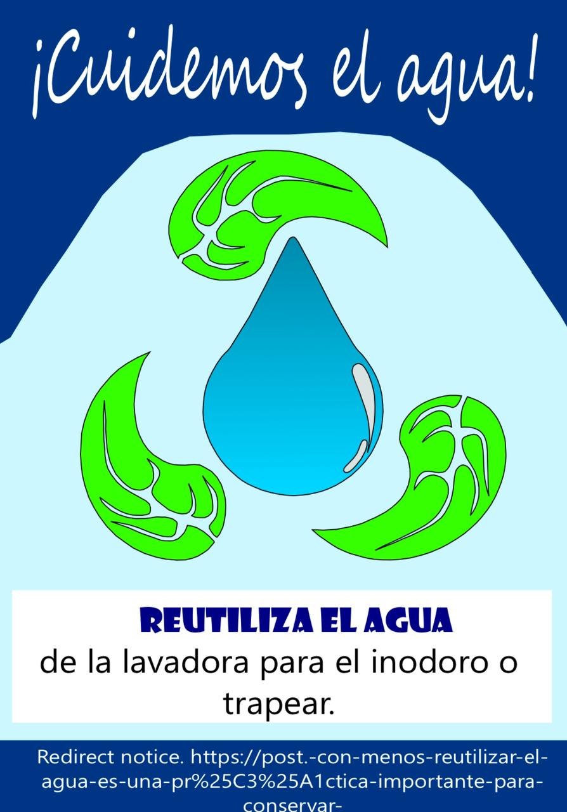

<html lang="es">
<head>
  <meta charset="UTF-8">
  <title>Proyecto 7 R´s</title>
  
</head>
<body>

  <h1 style="text-align: center; border: 2px solid black; font-family: 'Arial Rounded MT Bold'; color: ForestGreen;">
    7 R´s de la Sostenibilidad
  </h1>

  <h2 style="text-align: center;">¿Qué son las 7 R´s?</h2>
  

    Las 7 R son una evolución del concepto original de las 3 R (Reducir, Reutilizar, Reciclar) que surgió en la década de 1970 como parte de campañas ambientales. Con el tiempo, se ampliaron para formar un sistema más completo de gestión ambiental que busca combatir el consumo excesivo y el modelo lineal de "usar y tirar".
  

  

    Estas acciones están ordenadas jerárquicamente: primero se debe intentar rediseñar o reducir antes que reciclar, ya que esto evita que los residuos se generen desde el principio.
  

  

    <figure>
      
      <figcaption>El auge de la sostenibilidad y el aumento de la preocupación por el daño al medioambiente han impulsado más acciones para cuidarlo.</figcaption>
    </figure>
  

  

    <a href="C:\Users\dell\Documents\que son las 7 r.html">Qué son las 7R.</a>
  

  <h2>¿Qué beneficios tienen las 7 R´s?</h2>
  
La regla de las 7 erres promueve una economía circular que beneficia al planeta y a nosotros:

  <ul>
    <li>Menos residuos: menos basura y menos contaminación.</li>
    <li>Menor uso de materias primas, que son finitas.</li>
    <li>Menor gasto de energía y recursos.</li>
    <li>Mayor aprovechamiento de recursos existentes.</li>
  </ul>

  <figure style="float: left; margin: 10px; width: 300px;">
    
    <figcaption style="text-align: center;">Por un planeta con más vida.</figcaption>
  </figure>

  <figure style="float: right; margin: 10px; width: 300px;">
    
    <figcaption style="text-align: center;">Hagamos del planeta un lugar más verde.</figcaption>
  </figure>

  

  <h2 style="text-align: center;">¿Dónde aplicar las 7 R´s?</h2>

  

    
En casa

    <ul>
      <li>Rediseñar hábitos de consumo.</li>
      <li>Usar botellas reutilizables y bolsas ecológicas.</li>
      <li>Reparar electrodomésticos y ropa.</li>
      <li>Hacer composta con residuos orgánicos.</li>
    </ul>
  

  

    
En empresas

    <ul>
      <li>Optimizar procesos para generar menos desechos.</li>
      <li>Implementar políticas de economía circular.</li>
      <li>Usar embalajes reciclables o retornables.</li>
      <li>Crear programas de reciclaje y reutilización.</li>
    </ul>
  

  

    
En escuelas

    <ul>
      <li>Usar cuadernos reutilizables o digitales.</li>
      <li>Realizar talleres de reciclaje o manualidades.</li>
      <li>Incluir educación ambiental en el currículo.</li>
      <li>Llevar botellas reutilizables.</li>
    </ul>
  

  

    <a href="C:\Users\dell\Documents\impacto comunity.html">Impacto de las 7R en mi comunidad.</a>
  

  <h2 style="text-align: center;">¿Cómo poner en práctica cada R?</h2>
  

    <table>
      <tr>
        <th>R</th>
        <th>¿Qué implica?</th>
        <th>¿Qué puedes hacer?</th>
        <th>Imagen</th>
      </tr>
      <tr>
        <td>Rediseñar</td>
        <td>Cambiar el diseño para ser sostenible.</td>
        <td>Elegir productos duraderos, locales o biodegradables.</td>
        <td></td>
      </tr>
      <tr>
        <td>Reducir</td>
        <td>Consumir menos y mejor.</td>
        <td>Planificar compras y evitar desperdicios.</td>
        <td></td>
      </tr>
      <tr>
        <td>Reutilizar</td>
        <td>Volver a usar sin desechar.</td>
        <td>Reutilizar frascos, bolsas y cajas.</td>
        <td></td>
      </tr>
      <tr>
        <td>Reciclar</td>
        <td>Separar y transformar materiales.</td>
        <td>Clasificar residuos y llevarlos al punto limpio.</td>
        <td></td>
      </tr>
      <tr>
        <td>Reparar</td>
        <td>Arreglar lo que se rompe.</td>
        <td>Buscar talleres o tutoriales.</td>
        <td></td>
      </tr>
      <tr>
        <td>Recuperar</td>
        <td>Extraer valor de residuos.</td>
        <td>Hacer composta, reciclar electrónica.</td>
        <td></td>
      </tr>
      <tr>
        <td>Rechazar</td>
        <td>No consumir productos dañinos.</td>
        <td>Evitar plásticos de un solo uso o tóxicos.</td>
        <td></td>
      </tr>
    </table>
  

  <h2 style="text-align: center;">Cuida el planeta haciendo uso de las 7 R´s</h2>
  
Mira el siguiente video y aprende cómo cuidar el planeta:

  

    <video width="480" controls>
      <source src="https://youtu.be/YGMeO5L_LAs?si=iORAYpvyiqqhIz5K" type="video/mp4">
      Tu navegador no soporta video.
    </video>
  

  <h2 style="text-align: center; color: green;">¿Sabías que?</h2>
  <ul>
    <li>Si toda la población viviera como en los países más consumistas, necesitaríamos 3 planetas.</li>
    <li>Un envase Tetra Pak puede tardar más de 30 años en degradarse.</li>
    <li>Suecia y Japón reciclan o recuperan más del 90% de sus residuos.</li>
  </ul>

  

    <figure>
      
      <figcaption>Implementa acciones para cuidar al medio ambiente.</figcaption>
    </figure>
  

  <h2 style="text-align: center; color: green;">Documental sobre el cuidado del medio ambiente</h2>
  
Escucha el siguiente audio y aprende cómo cuidar el medio ambiente:

  

    <audio controls>
      <source src="C:\Users\dell\Desktop\Downloads\videoplayback.m4a" type="audio/mpeg">
      Tu navegador no soporta audio.
    </audio>
  

</body>
</html>
